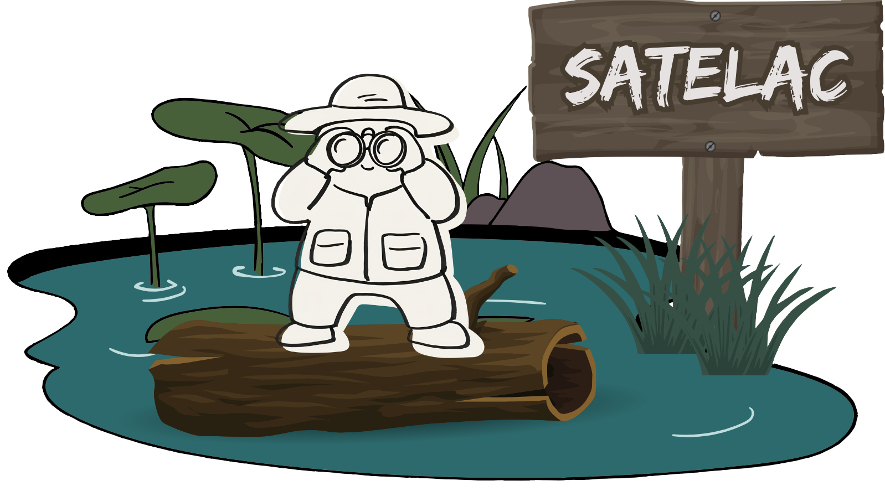

<h1 align="center">
  
</h1>

# Introduction
This repository contains the source code for **SATELAC**, an app that can be used to monitor the water quality of lakes. The project  was developed as part of the <a href="https://github.com/Romanian-Space-Initiative"> ROSPIN Summer School</a>. 

# How to run
You can access the app on the following page:

# Functionalities
SATELAC allows the user to check the evolution of the water quality of a lake. Although there are multiple functionalities that focus on Romanian lakes, it can be used to check the state of any lake.  
Functionalities include being able to:
- Check the evolution of a lake in a period around a specified day;
- Check the evolution of a lake across the last 30 days from the day specified;
- Check the evolution of a lake 
- Automatically select most lakes in a Romanian County to analyse;
- Manually add lakes or parts of them for analysis, which can be named for convinience.

# Documentation
SATELAC uses remote sensing to monitor the *Normalized Difference Chlorophyll Index* (**NDCI**), the *Normalized Difference Turbidity Index* (**NDTI**) and the *Colored Dissolved Organic Mater* (**CDOM**) for a time series. These can be treated as indicators for certain events that can impact water quality, like algal blooms or sediment plumes. A more in-depth explanation, as well as sources, can be found in the **<a href="https://docs.google.com/document/d/1oqhylmwxvWNdqpimZDChHtjaqnGKMM7P9XnF26lBTM4/edit?usp=sharing">report</a>**.

The app uses data from **NASA's Harmonized Landsat and Sentinel-2** (HLS) project and **Google Earth Engine** (GEE) to perform the computations necessary to process it. Cloud masking is done using the _Scene Classification_ (SCL) band and GEE's _Cloud Score+_ dataset, which rates the accuracy of pixels. The latter also removes haze.

The lakes are extracted via the *Modified Normalized Difference Water Index* (**MNDWI**), which can be used to detect the water pixels.

Evaluating a lake can lead to one of results, classified by color:
- 🟩 **GREEN**: the state of the lake **has improved**, the indexes have considerably lower values compared to the previous week;
- 🟨 **YELLOW**: the state of the lake is mostly **unchanged** to that of the last week;
- 🟥 **RED**: the state of the lake **has worsened**, as the indices have considerably higher values compared to the previous week - this may signify an anomaly, such as an algal bloom or a sediment plume.
- 🔳 **GRAY**: data is missing